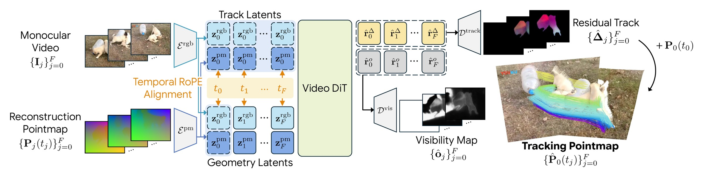
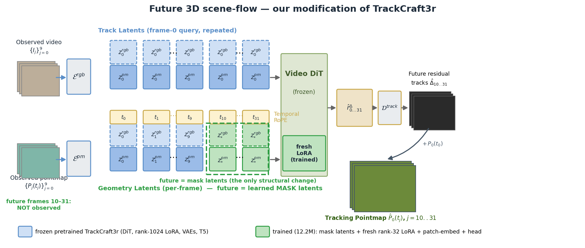
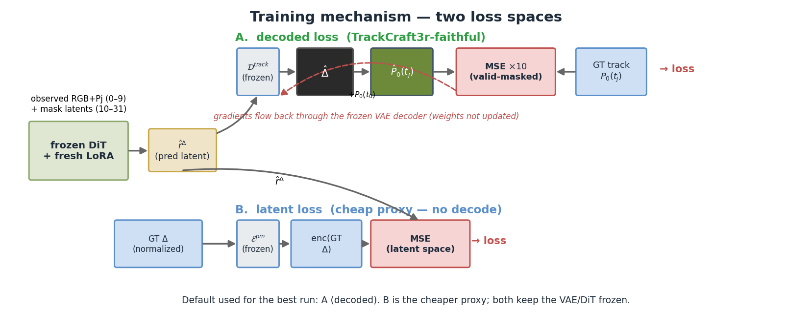

# What we changed from TrackCraft3r (and the training mechanism)

This document explains exactly how the future-prediction model differs from the
released TrackCraft3r, and how it is trained. It uses TrackCraft3r's own notation
(`E^rgb`/`E^pm` encoders, `z^rgb`/`z^pm` latents, Track vs Geometry latents,
Video DiT, `D^track`/`D^vis` decoders).

---

## 1. TrackCraft3r, in one paragraph

TrackCraft3r is a **single-pass** dense 3D tracker. Given a *fully observed*
monocular video `{I_j}` and its reconstruction pointmap `{P_j(t_j)}` (depth
unprojected into frame-0 camera space), it VAE-encodes both streams and forms two
sets of latents over the `F+1` frames:

- **Geometry Latents** (the "diagonal"): per-frame `[z_j^rgb | z_j^pm]`, j = 0…F.
- **Track Latents** (the "row"/query): frame-0 latents `[z_0^rgb | z_0^pm]`, repeated F+1 times.

The Video DiT (Wan2.1-1.3B + rank-1024 LoRA), with temporal-RoPE alignment,
maps these to residual-track latents `r̂^Δ` and visibility latents `r̂^o`, which
`D^track` / `D^vis` decode into the **residual track** `Δ̂_j` and **visibility
map** `ô_j`. Adding the frame-0 anchor gives the **tracking pointmap**
`P̂_0(t_j) = Δ̂_j + P_0(t_0)`. There is **no diffusion sampling** — it is a single
regression step at a fixed timestep. (Code: `diffsynth/pipelines/wan_video_new.py`
`model_fn_wan_video`.)

---

## 2. Our modification (future prediction)

We want to predict tracks for frames **10–31** given only the **first 10**
observed frames. We keep the entire pipeline and make **one structural change**:

> In the **Geometry Latents** stream, the unobserved future frames (10–31) have
> no RGB/Pj to encode, so we replace their `z_j^rgb` / `z_j^pm` with **two learned
> mask latents** (`rgb_mask_latent`, `pj_mask_latent`), broadcast over space and
> over all future frames. The Track Latents (frame-0 query) are unchanged.

The frozen DiT then attends from the future query rows to the observed diagonal
entries + mask tokens and regresses the future residual tracks; temporal RoPE
already gives each future frame a distinct position, so one shared mask latent
per stream suffices. (Code: `future_scene_flow/model.py` `_build_input_streams`.)

### Exact diff vs TrackCraft3r

| # | Aspect | TrackCraft3r (original) | Ours |
| --- | --- | --- | --- |
| 1 | Temporal length | F+1 ≈ 12 fully observed | 32 frames; only first 10 observed |
| 2 | Future geometry latents | all real `z_j` | **frames 10–31 = learned mask latents** ← only new structure |
| 3 | Track (query) latents | frame-0, repeated | unchanged |
| 4 | Adapter | rank-1024 LoRA (trained in release) | rank-1024 LoRA **frozen** + **new rank-32 LoRA** (self-attn q,k,v,o) trained |
| 5 | Other trainable | DiT-LoRA, I/O, (stage-2) VAE | **patch-embed + head + mask latents** only |
| 6 | Visibility head `D^vis` | trained (balanced BCE) | kept to load weights, **not supervised** (no GT visibility in our data) |
| 7 | Loss | decode → coord-space MSE×10 + vis-BCE | same decoded MSE×10 (validity-masked) **or** latent proxy; no vis term |
| 8 | Pj normalization | over all frames | over **observed frames only** (future depth unavailable) |
| 9 | Resolution / data | 480×832, synthetic | 320×576 (fits 24 GB), Something-Something dense tracks |

**Unchanged / faithful:** the dual-stream diagonal-row construction, single-step
regression at a fixed timestep, the 16→32-channel `patch_embedding`, the 2×
visibility-expanded `head`, and all `E^rgb`/`E^pm`/`D^track`/`D^vis`/DiT weights.

### What actually trains (12.19 M)

| Component | Params | Frozen? |
| --- | --- | --- |
| fresh rank-32 LoRA (self-attn q,k,v,o, ×30 blocks) | 11.80 M | **trained** |
| `patch_embedding` (Conv3d 32→1536) | 0.20 M | **trained** |
| `head` (Linear 1536→128 + modulation) | 0.20 M | **trained** |
| `rgb_mask_latent`, `pj_mask_latent` | 32 | **trained** |
| base Wan2.1 DiT (~1.3 B), rank-1024 LoRA, `E^rgb`,`E^pm`,`D^track`,`D^vis`, T5 | — | frozen |

Both LoRA adapters are *active* in the forward pass (their deltas sum); only the
fresh one receives gradients. (Code: `model_fresh_lora.py`.)

---

## 3. Training mechanism

Per step: encode the 10 observed frames → build the 32-frame Geometry/Track
latents with mask latents for the future → run the frozen DiT (+ fresh LoRA) →
get predicted residual-track latents `r̂^Δ`. Two loss spaces:

**A. Decoded loss (TrackCraft3r-faithful, default for the best run).**
Decode `r̂^Δ` through the frozen `D^track` VAE to a 3D pointmap, reconstruct
`P̂_0(t_j) = Δ̂_j + P_0(t_0)`, and take **MSE in coordinate space, ×10**, masked
by track validity and weighted (observed 0.25 / future 1.0). This mirrors
TrackCraft3r's `training_loss` (`wan_video_new.py:148`) — except it masks by
validity instead of GT visibility and drops the visibility BCE. Gradients flow
**through** the frozen VAE decoder (its weights are not updated), so the decode is
done one frame at a time with gradient checkpointing to fit 32 frames in memory.
(Code: `losses.py` `decoded_loss`, `model.py` `decode_xyz_grad`.)

**B. Latent loss (cheap proxy).**
Regress `r̂^Δ` directly toward `E^pm(GT Δ)` (the VAE encoding of the normalized
GT residual) with MSE — no decode, so no backprop through the VAE. Faster, but
optimizes a proxy; this is why its val-loss and decoded ADE can drift apart.
(Code: `losses.py` `latent_loss`.)

Supervision target comes straight from the dense NPZ `track_map` (GT `P0(t_j)`),
normalized with the **observed-frame** Pj statistics. Optimizer: AdamW over the
12.19 M trainable params only; bf16 autocast; DiT gradient-checkpointed. Best run:
fresh-LoRA + decoded loss @ 320×576 → **5.27 cm** val future-ADE (epoch 13).

To regenerate the figures: `python models_pretrained/figures/make_figures.py`.
